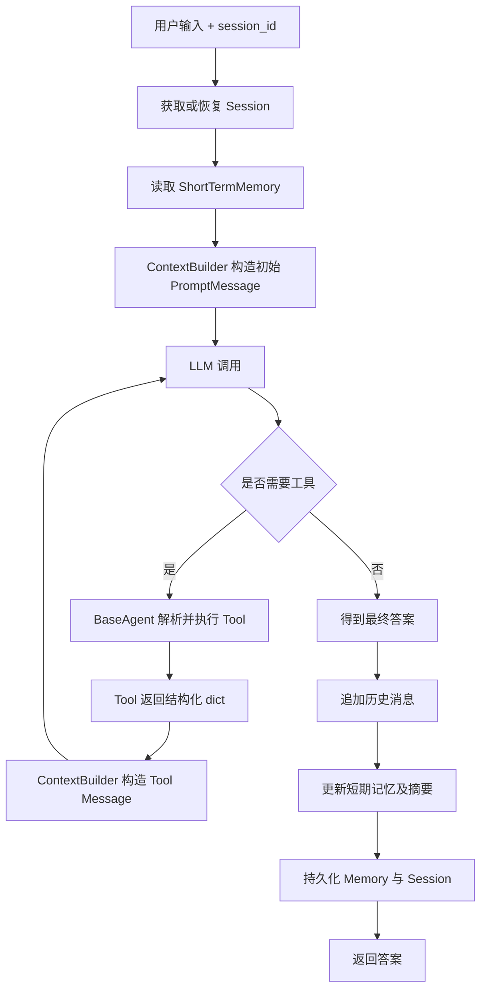
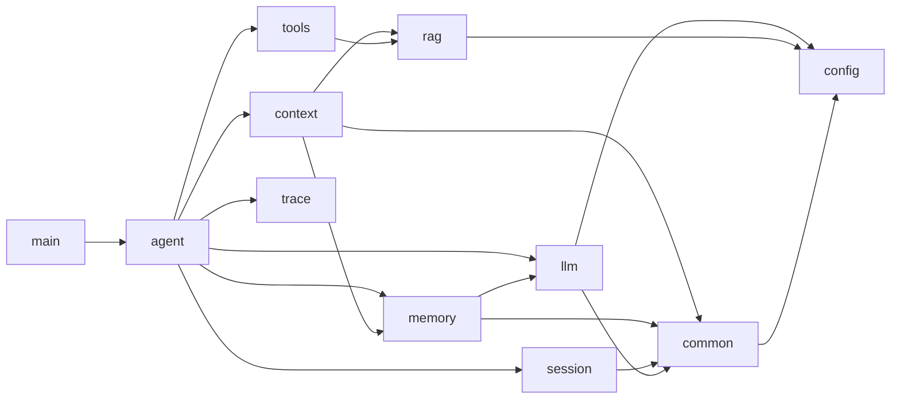

# Agent Learning

用于学习、验证和沉淀 AI Agent 相关知识与实践的实验仓库。

本仓库并非以构建生产级 Agent 框架为目标，而是通过动手实现的方式验证对 Agent 核心概念、架构模式和执行流程的理解。

## 学习目标

逐步理解并实践：

* Tool Calling
* Memory
* RAG（Retrieval Augmented Generation）
* Context Engineering
* ReAct
* Plan & Execute
* Multi-Agent

## 当前实现

* LLM Client
* Tool Registry
* Tool Calling
* Agent Loop（Demo）
* Memory（短期记忆已接入 Demo）
* Session（会话元信息持久化、恢复与切换）
* RAG（本地检索 Demo 已通过 Tool 接入）
* Context Builder（基础消息组装）

## 当前进度

### Memory

当前已接入短期记忆和历史消息持久化。历史消息用于记录真实 user/assistant 输入输出，短期记忆用于在当前 Session 中保留摘要和最近消息，并支持服务重启后的基础恢复。

Memory 内部负责判断何时生成摘要、选择待摘要消息、调用 LLM 和写回摘要。Memory Summary Prompt 与模板由 `memory` 包管理，不依赖 Agent 的 Context Builder。

### Session

`SessionInfo` 记录 Session ID、标题、创建时间、更新时间和最后一条消息 ID。`SessionRepository` 支持按 Session ID 读写元信息，并通过扫描 `session/*.json` 获取可恢复的会话列表。

Session 采用懒加载策略：Agent 启动时不加载所有会话内容，只在用户选择或运行指定 Session 时恢复对应的 SessionInfo 和短期记忆。新的 Session 只有在完成一轮成功对话后才持久化，避免空会话污染恢复列表。

本地存储通过 `STORE_DIR` 配置，当前结构为：

```text
data/store/
  history/
  short_term_memory/
  session/
```

### Context

跨模块使用的 LLM 消息统一为 `common.models.PromptMessage`，由 `LlmClient` 在调用边界转换为模型接口需要的消息格式。

`ContextBuilder` 当前负责将系统提示词、`ShortTermMemory`、当前用户输入、筛选后的 `SearchResult` 和 Tool 执行结果转换为 `PromptMessage`。Memory、RAG 和 Tool 在进入 Context 前保留各自的结构化输出，不提前拼接成最终对话字符串。

当前 Context 仍处于基础消息组装阶段，尚未实现跨来源选择、token 预算、原子消息组裁剪和 Context 构建报告。

### RAG

当前已实现本地文档加载、切分、检索、合并和重排序。RAG 对外保留结构化 `SearchResult`，并通过 `SearchTool` 接入当前 Agent Loop。`SearchTool` 将检索结果转换为统一 Tool `dict`，进入 Agent 对话时再由 Context 转换为 Tool Message。

如果 RAG 后续使用 LLM 实现 Query Rewrite 或 LLM Reranker，对应 Prompt Builder 和模板由 RAG 内部管理，不与 Agent 的 Context Builder 混用。

## DemoAgent 主流程



当前 RAG 通过 `SearchTool` 进入 Tool Loop，因此检索结果在主流程中表现为 Tool 的结构化输出。未来增加主动 RAG 后，`SearchResult` 将先进入 Context Selector，再由 Context Builder 渲染。

## 包职责与调用关系

| 包 | 当前职责 | 主要依赖 |
|---|---|---|
| `agent` | Agent 生命周期、Session 恢复、Tool 执行编排、LLM Loop | Context、Memory、Session、Tools、LLM、Trace |
| `common` | 跨模块消息契约、角色类型、时间与本地存储基础能力 | Config |
| `config` | LLM、存储目录和 RAG 路径配置 | 无业务包依赖 |
| `context` | 将选定材料渲染为 Agent 使用的 `PromptMessage` | Common、Memory 输出模型、RAG 输出模型 |
| `llm` | 模型客户端及模型接口转换 | Common、Config |
| `memory` | 历史消息、短期记忆、摘要策略与内部摘要 Prompt | Common、LLM |
| `rag` | 文档加载、切分、召回、合并与重排 | Config |
| `session` | Session 元信息与持久化 | Common |
| `tools` | Tool 定义、注册、结构化执行结果和 RAG Tool 适配 | RAG |
| `trace` | Agent 执行过程记录与纯文本输出 | 无业务包依赖 |



图中的 `Context --> Memory/RAG` 表示 Context 消费其结构化输出模型，不表示 Context 执行记忆更新或检索策略。模块内部为了生成自身输出而进行的 LLM 调用和 Prompt 构建仍由对应模块负责。

## Context 演进方向

目标流程：

```text
Memory / RAG / Tool 产出结构化结果
        ↓
Agent 收集为 ContextDraft
        ↓
ContextSelector 统一选择与裁剪
        ↓
ContextBuilder 渲染 PromptMessage[]
        ↓
LLM
```

计划按以下顺序继续：

1. 定义 `ContextDraft`，集中保存当前用户输入、Memory、主动 RAG 结果和本轮 Tool Exchange。
2. 定义不可拆分的 `ToolExchange` 或 `ContextSegment`，保证 assistant tool call 与 tool result 成组处理。
3. 增加 `NoOpContextSelector`，先固定“每次调用 LLM 前执行 Selector”的生命周期，材料未超预算时原样返回。
4. 增加 `ContextEngine`，统一编排 Selector 与 Builder，Agent 只负责收集和更新 Draft。
5. 引入 token 估算与输入预算，始终保留系统指令和当前用户输入。
6. 实现确定性选择策略：优先保留摘要和最近完整轮次，优先删除低分 RAG 和最旧对话。
7. 增加 Context Trace，记录各来源 token、入选内容和裁剪原因。
8. 补充完整轮次、Tool Exchange 配对、预算边界和多来源竞争测试。

## 设计原则

### 先理解，再抽象

优先验证核心概念与执行流程，而不是提前设计复杂框架。

### 先实现，再优化

通过最小可运行实现（MVP）验证思路，后续再根据实际问题进行重构和抽象。

### 关注原理

重点关注：

* Agent 如何思考
* Agent 如何调用工具
* Agent 如何组织上下文
* Agent 如何使用记忆
* Agent 如何使用外部知识

而不仅仅是框架使用方式。

## 规划路线

```text
LLM
 ↓
Tool Calling
 ↓
Memory
 ↓
RAG
 ↓
Context Engineering
 ↓
ReAct
 ↓
Plan & Execute
 ↓
Multi-Agent
```

## 下一步计划

* 继续实现 Context Engineering，优先完成 `ContextDraft`、`ContextSelector`、`ContextEngine` 和 token 预算闭环。
* 修复短期记忆按消息数裁剪可能拆散完整对话轮次的问题。
* 为 Agent Loop 增加最大循环次数耗尽后的明确失败状态，避免保存空回答。
* Context 基础流程稳定后，再继续验证 ReAct 和 Plan & Execute。
* 后续再评估长期记忆提取与存储结构；当前 Memory Demo 先以短期记忆和历史消息持久化为主。

## 说明

本仓库中的代码、目录结构和设计方案可能会随着学习过程持续调整。

目标不是追求最终形态，而是记录从零理解 Agent 的完整过程。
