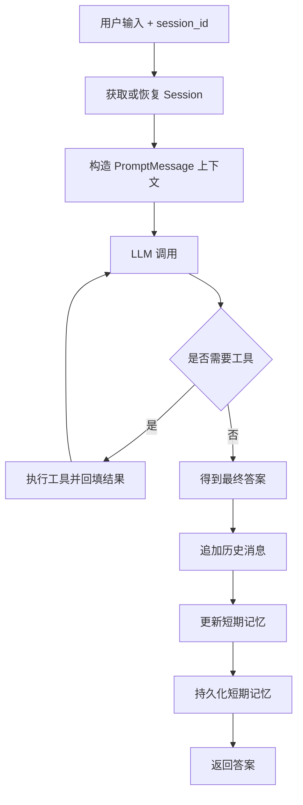

# Agent Learning

用于学习、验证和沉淀 AI Agent 相关知识与实践的实验仓库。

本仓库并非以构建生产级 Agent 框架为目标，而是通过动手实现的方式验证对 Agent 核心概念、架构模式和执行流程的理解。

## 学习目标

逐步理解并实践：

* Tool Calling
* Memory
* RAG（Retrieval Augmented Generation）
* Context Engineering
* ReAct
* Plan & Execute
* Multi-Agent

## 当前实现

* LLM Client
* Tool Registry
* Tool Calling
* Agent Loop（Demo）
* Memory（短期记忆已接入 Demo）
* RAG（本地检索 Demo 已接入）

## 当前进度

### Memory

当前已接入短期记忆和历史消息持久化。历史消息用于记录真实 user/assistant 输入输出，短期记忆用于在当前 session 中保留摘要和近 N 条对话，并支持服务重启后的基础恢复。

### Context

当前已将 LLM 交互消息统一为 `PromptMessage`，由 `context` 负责组织运行时上下文，在 `LlmClient` 边界转换为模型接口需要的消息格式。

### RAG

当前已实现本地 RAG Demo，包括文档加载、切分、检索、重排序和结果格式化，并通过 `SearchTool` 接入 Tool Calling。

## DemoAgent 主流程



## 设计原则

### 先理解，再抽象

优先验证核心概念与执行流程，而不是提前设计复杂框架。

### 先实现，再优化

通过最小可运行实现（MVP）验证思路，后续再根据实际问题进行重构和抽象。

### 关注原理

重点关注：

* Agent 如何思考
* Agent 如何调用工具
* Agent 如何组织上下文
* Agent 如何使用记忆
* Agent 如何使用外部知识

而不仅仅是框架使用方式。

## 规划路线

```text
LLM
 ↓
Tool Calling
 ↓
Memory
 ↓
RAG
 ↓
Context Engineering
 ↓
ReAct
 ↓
Plan & Execute
 ↓
Multi-Agent
```

## 下一步计划

* 接入 Session 持久化与会话列表。
* 完善短期记忆恢复策略，区分 Session 主体恢复和 Memory 恢复。
* 为 CLI 输出增加更明确的纯文本格式约束。
* 评估长期记忆提取与存储结构。

## 说明

本仓库中的代码、目录结构和设计方案可能会随着学习过程持续调整。

目标不是追求最终形态，而是记录从零理解 Agent 的完整过程。
